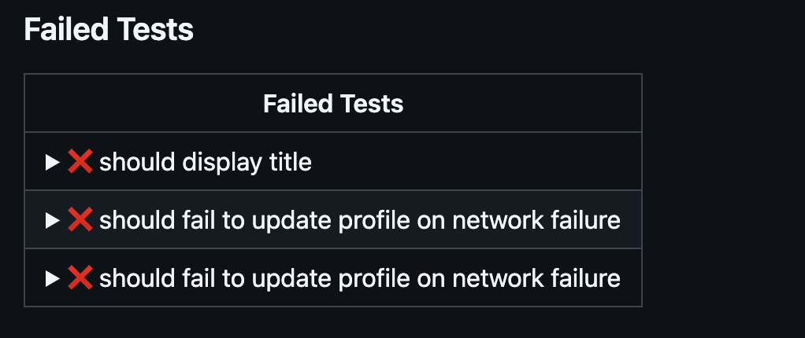
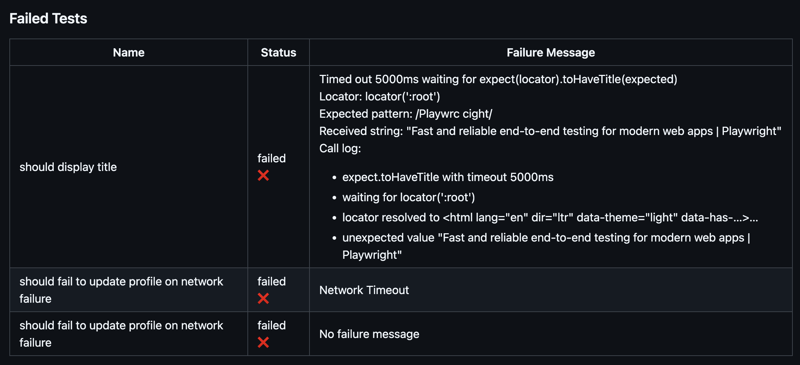
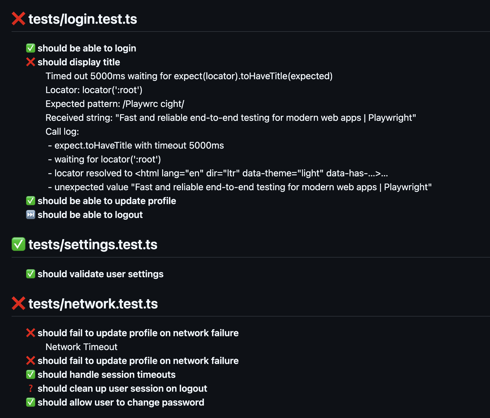

# Publish and View Test Results Reports in Github Actions

> Integrate Test Reporting into Your GitHub Actions Workflow

A GitHub test reporting tool that supports all major testing frameworks.
Generate, publish and alert your team with detailed test results, including
summaries, in-depth reports, failed test analyses, flaky test detection and AI
analyses directly within your GitHub Actions CI/CD workflow and Pull Requests.

Choose from a variety of pre-built reports or create custom reports tailored to
your project's needs, ensuring that test results are always where you need them.

## **⭐⭐ If you find this project useful, consider giving it a GitHub star ⭐⭐**

## You can help us grow

Support our mission to enhance test reporting in Github Actions by:

- **⭐ Starring this repository to show your support. ⭐**
- **🙌 Following our [GitHub page here](https://github.com/ctrf-io) to stay
  updated. 🙌**

Building for the community takes time, and a small gesture of support is a
rewarding boost that makes it all worthwhile.

Thank you! Your support is invaluable to us! 💙

## Key Features

- **Seamless Integration:** Build, view and publish test reports directly within
  the GitHub Actions workflow summary.
- **Built In Reports:** Access a variety of built in reports including
  Historical, Detailed Test Results, Failed Tests Overview, and Flaky Tests
  Analysis.
- **Build Your Own Reports:** Build and customize your own test reports to fit
  specific project requirements.
- **AI Report**: Publish an AI generated report to help resolve failed tests.
- **Broad Framework Support:** Compatible with all major testing frameworks
  through standardized CTRF reports.

## Visual Overview

|                    |        |  |          |                  |
| :--------------------------------------: | :----------------------------------------: | :----------------------------------: | :--------------------------: | :----------------------------------: |
|  |  |          |  |  |

## Table of Contents

1. [Usage](#usage)
2. [Available Inputs](#available-inputs)
3. [Pull Requests](#pull-requests)
4. [Build Your Own Report](#build-your-own-report)
5. [Community Reports](#community-reports)
6. [GitHub Token](#github-token)
7. [Storing Artifacts](#storing-artifacts)
8. [Filtering](#filtering)
9. [Generating an AI Report](#generating-an-ai-report)
10. [Flaky Rate Calculation](#flaky-rate-calculation)
11. [Failed Rate Calculation](#failed-rate-calculation)
12. [Run With NPX](#run-with-npx)
13. [Report Showcase](#report-showcase)
14. [What is CTRF?](#what-is-ctrf)

## Usage


[](https://github.com/ctrf-io/github-actions-ctrf/actions/workflows/main.yaml)


To get started add the following to your workflow file:

```yaml
- name: Publish Test Report
  uses: ctrf-io/test-reports@v1
  with:
    report-path: './ctrf/*.json'
  if: always()
```

This will publish the default reports `summary-report`, `failed-report`,
`flaky-report`, `skipped-report`, and `test-report` to the job summary.

## Generate a CTRF report

[CTRF reporters](https://github.com/orgs/ctrf-io/repositories) are available for
most testing frameworks and easy to install.

**No CTRF reporter? No problem!**

Use [junit-to-ctrf](https://github.com/ctrf-io/junit-to-ctrf) to convert a JUnit
report to CTRF

## Available Inputs

There are several inputs available

```yaml
- name: Publish Test Report
  uses: ctrf-io/test-reports@v1
  with:
    # Core Configuration
    report-path: './ctrf/*.json' # Path or glob pattern to the CTRF report JSON file.
    template-path: './templates/custom-summary.hbs' # Path to the Handlebars template for customizing markdown output.

    # Reports - Choose as many as you like
    summary-report: true
    test-report: false
    test-list-report: false
    failed-report: false
    fail-rate-report: false
    flaky-report: false
    flaky-rate-report: false
    failed-folded-report: false
    previous-results-report: false
    ai-report: false
    skipped-report: false
    suite-folded-report: false
    suite-list-report: false
    pull-request-report: false
    custom-report: false

    # Behavior Options
    summary: false # Post report to the job summary. Default is true
    pull-request: false # Comment on pull request with report. Default is false
    annotate: false # Add failed test annotations. Default is true
    on-fail-only: false # Add a pull request comment only if tests fail. Default is false
    exit-on-fail: false # Exit the workflow with a failure status if any tests fail. Default is false
    use-suite-name: false # Prefix test names with the suite name for better grouping. Default is false
    update-comment: false # Update existing Pull Request comment. Default is false
    overwrite-comment: false # Overwrite existing Pull Request comment. Default is false
    comment-tag: false # Tag to match Pull Request comment

    # Advanced Options
    artifact-name: false # Name of the artifact containing test reports. Default is ctrf-report
    previous-results-max: false # Maximum number of previous test results to display in the report. Default is 10
    fetch-previous-results: false # Always fetch previous workflow runs when using custom templates. Default is false
    group-by: 'filePath' # Specify grouping for applicable reports (e.g., suite or file path). Default is filePath
    always-group-by: false # Force grouping by suite or file path for all reports. Default is false
    debug: false # Enable debug mode for verbose logging. Default is false
  if: always()
```

Only `report-path` is required.

## Pull Requests

There are two ways you can post comments on pull requests.

You can add a pull request comment by using the `pull-request-report` input:

```yaml
- name: Publish Test Report
  uses: ctrf-io/test-reports@v1
  with:
    report-path: './ctrf/*.json'
    pull-request-report: true
  env:
    GITHUB_TOKEN: ${{ secrets.GITHUB_TOKEN }}
  if: always()
```

This uses a built-in pull request comment report.

Additionally, you can add any report to a pull request comment by adding the
`pull-request` input:

```yaml
- name: Publish Test Report
  uses: ctrf-io/test-reports@v1
  with:
    report-path: './ctrf/*.json'
    flaky-rate-report: true
    pull-request: true
  env:
    GITHUB_TOKEN: ${{ secrets.GITHUB_TOKEN }}
  if: always()
```

The `pull-request` input works with all reports, including custom.

You must provide a GITHUB_TOKEN with write permissions for pull requests

### Comment Management Inputs

`--update-comment` An existing tagged comment is found, the new report is
appended to it. Otherwise, a new comment is created.

`--overwrite-comment` An existing tagged comment is found, that comment’s entire
content is replaced with the new report. Otherwise, a new comment is created.

`--comment-tag` A unique identifier for comments posted. Used to find and
update/overwrite existing comments.

For example, the following command creates or updates a comment tagged with the
current workflow and job names:

```yaml
- name: Publish Test Report
  uses: ctrf-io/test-reports@v1
  with:
    report-path: './ctrf/*.json'
    flaky-rate-report: true
    pull-request: true
    update-comment: true
    comment-tag: '${{ github.workflow }}-${{ github.job }}'
  env:
    GITHUB_TOKEN: ${{ secrets.GITHUB_TOKEN }}
  if: always()
```

## Build Your Own Report

The `custom-report` input lets you build your own report using a Handlebars
template. The template can include any markdown content and leverage data from
your CTRF report and GitHub properties, allowing for dynamic and customizable
report.

Add the following to your workflow file:

```yaml
- name: Publish Test Report
  uses: ctrf-io/test-reports@v1
  with:
    report-path: './ctrf/*.json'
    template-path: './templates/custom-report.hbs'
    custom-report: true
  if: always()
```

For detailed instructions on building your own reports, see the
[documentation](docs/build-your-own-report.md).

For inspiration, check out the [built-in reports](src/reports),
[community reports](community-reports) and an
[example](templates/custom-report.hbs)

## Community Reports

We welcome and encourage contributions of community-built reports. Community
reports allow users to share custom reports designed for specific use cases.

To submit a community-built report create a Pull Request.

You can use reports [community built reports](community-reports) by adding the
following to your workflow file:

```yaml
- name: Publish Test Report
  uses: ctrf-io/test-reports@v1
  with:
    report-path: './ctrf/*.json'
    community-report: true
    communty-reportn-name: summary-short
  if: always()
```

## GitHub Token

`previous-results-report`, `flaky-rate-report` and `fail-rate-report` need a
GITHUB_TOKEN:

```yaml
- name: Publish Test Report
  uses: ctrf-io/test-reports@v1
  with:
    report-path: './ctrf/*.json'
    flaky-rate-report: true
  env:
    GITHUB_TOKEN: ${{ secrets.GITHUB_TOKEN }}
  if: always()
```

## Storing Artifacts

Some reports require you to store CTRF reports as artifacts:

```yaml
- name: Upload test results
  uses: actions/upload-artifact@v4
  with:
    name: ctrf-report
    path: path-to-your-ctrf-report.json
  if: always()
```

## Filtering

`previous-results-report`, `flaky-rate-report` and `fail-rate-report` filter
previous results as follows:

- Runs from the same branch for events of type push, schedule and
  workflow_dispatch from the same workflow id
- Runs from the same pull request for events of type pull_request from the same
  workflow id

This ensures that you only see workflow runs that are related to your current
branch or pull request

## Generating an AI Report

You can generate human-readable AI report for your failed tests using models
from the leading AI providers by using the
[AI Test Reporter](https://github.com/ctrf-io/ai-test-reporter)

## Flaky Rate Calculation

The flaky rate measures how often tests exhibit flaky behavior—tests that fail
initially but pass upon retry. This metric helps identify unstable tests that
may need attention to improve reliability. Using test retries is fundamental for
the detection of flaky tests with CTRF.

Test Flaky Rate (%) is calculated by dividing the number of flaky occurrences by
the total number of test attempts (including retries) and multiplying by 100:

Flaky Rate (%) = (Flaky Occurrences ÷ Total Attempts) × 100

Overall Flaky Rate across all tests is calculated by summing the flaky
occurrences and total attempts of all tests:

Overall Flaky Rate (%) = (Total Flaky Occurrences of All Tests ÷ Total Attempts
of All Tests) × 100

## Failed Rate Calculation

The failed rate measures how often tests fail based on their final outcome,
disregarding any retries. This metric helps identify tests that consistently
fail, allowing you to prioritize fixes and enhance overall test reliability.

Test Fail Rate (%) is calculated by dividing the fail count by the total runs
and multiplying by 100:

Fail Rate (%) = (Fail Count ÷ Total Runs) × 100

Overall Fail Rate across all tests is calculated by summing the fail counts and
total runs of all tests:

Overall Fail Rate (%) = (Total Fail Counts of All Tests ÷ Total Runs of All
Tests) × 100

## Run With NPX

You can run using `npx`, see full instructions here

## Report Showcase

[Click here](https://github.com/ctrf-io/github-actions-ctrf/actions) to see the
Actions of this repository for a showcase

## What is CTRF?

A test results report schema that provides a standardized format for JSON test
reports.

**Consistency Across Tools:** Different testing tools and frameworks often
produce reports in varied formats. CTRF ensures a uniform structure, making it
easier to understand and compare reports, regardless of the testing tool used.

**Language and Framework Agnostic:** It provides a universal reporting schema
that works seamlessly with any programming language and testing framework.

**Facilitates Better Analysis:** With a standardized format, programatically
analyzing test outcomes across multiple platforms becomes more straightforward.

## Support Us

If you find this project useful, consider giving it a GitHub star ⭐ It means a
lot to us.
